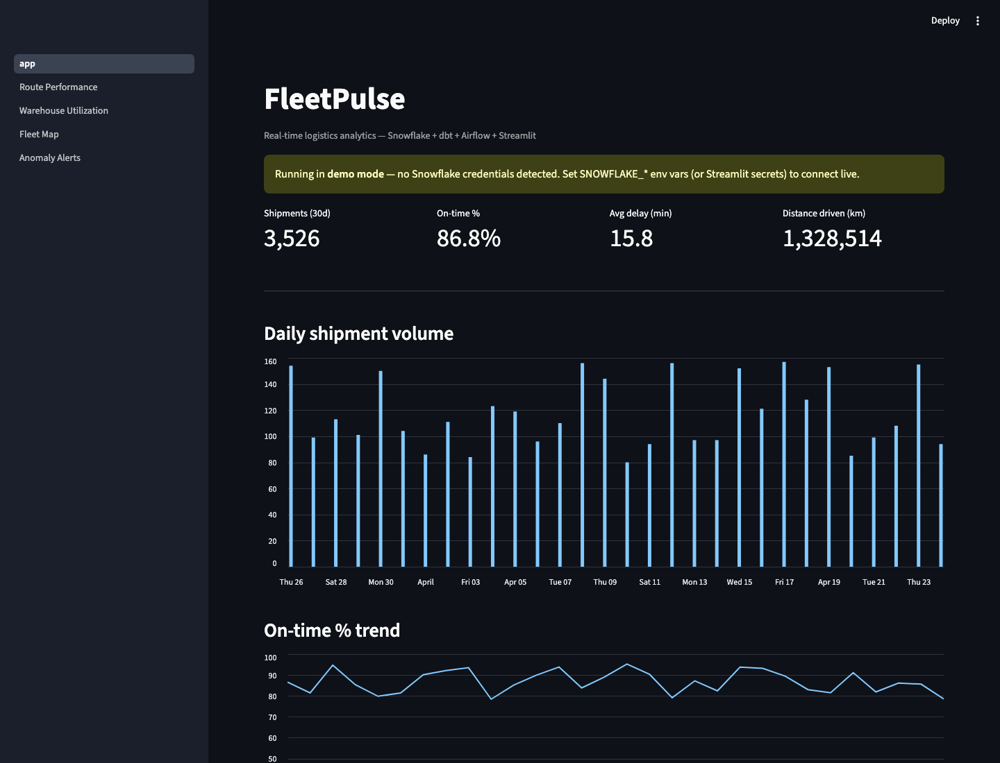
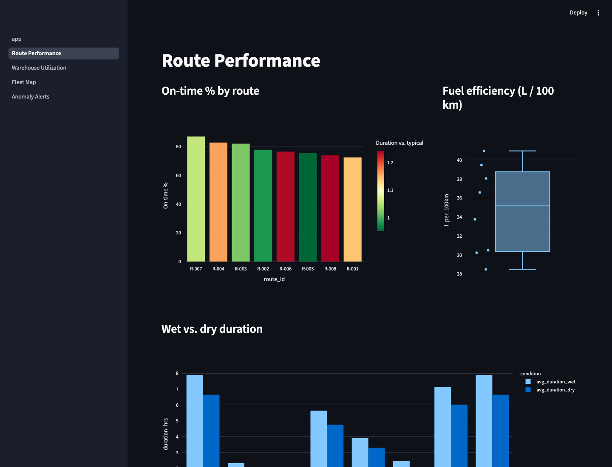
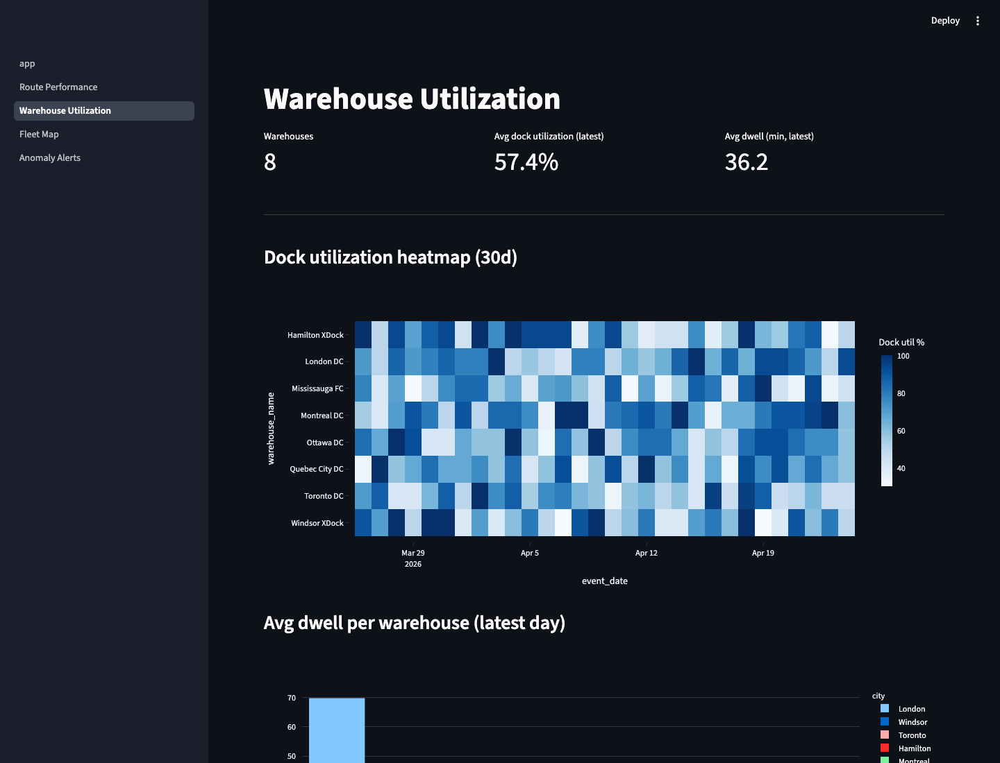
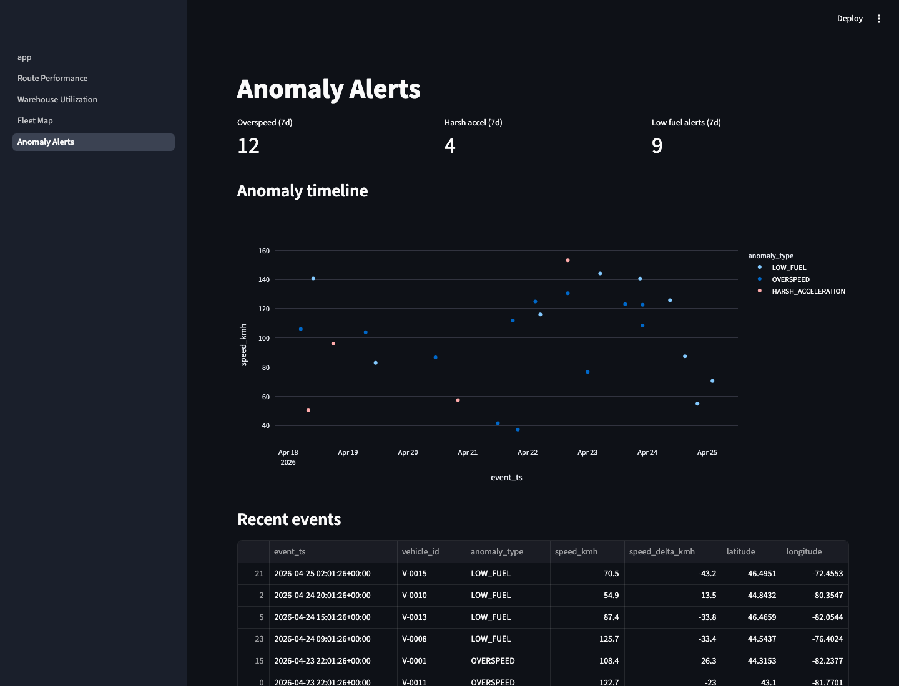

# FleetPulse

[](https://github.com/dpaq7/fleetpulse/actions/workflows/ci.yml)
[](https://www.python.org/downloads/release/python-3110/)
[](https://docs.getdbt.com/reference/warehouse-setups/snowflake-setup)
[](https://github.com/pre-commit/pre-commit)
[](LICENSE)

> Real-time logistics analytics platform: Snowflake + dbt + Airflow + Streamlit

FleetPulse is a portfolio-grade data engineering project that simulates a production logistics analytics system. It ingests GPS telemetry, shipment records, weather, and warehouse IoT signals, processes them through a Snowflake-based analytics warehouse, and delivers insights via a live Streamlit dashboard.

## Architecture

```
  Sources                  Ingestion               Warehouse              Serving
  -------                  ---------               ---------              -------
  GPS Simulator  ─┐
  OpenWeather API ┼─► S3 ─► Snowpipe ─► RAW ─► dbt ─► STAGING ─► MARTS ─► Streamlit
  Shipments CSV   │                      │                                   │
  Warehouse IoT  ─┘                   Streams+Tasks                      Plotly / Map
                                      (5-min CDC)
```

See `FleetPulse_Project_Blueprint.docx` for the full design spec and `docs/architecture.md` for diagrams.

## Dashboard preview

The Streamlit app runs end-to-end without credentials in **demo mode**, backed by deterministic synthetic data drawn from the same reference dimensions used by the simulators.

| Fleet KPIs | Route Performance |
| --- | --- |
|  |  |

| Warehouse Utilization | Anomaly Alerts |
| --- | --- |
|  |  |

> Screenshots captured against the demo dataset — `make run-dashboard` reproduces them on a fresh clone.

## Tech Stack

| Layer          | Technology                          |
| -------------- | ----------------------------------- |
| Warehouse      | Snowflake (trial)                   |
| Storage        | AWS S3 (free tier)                  |
| Transformation | dbt Core (`dbt-snowflake`)          |
| Orchestration  | Apache Airflow (Docker)             |
| Ingestion      | Snowpipe + Python                   |
| Quality        | dbt tests + Great Expectations      |
| Dashboard      | Streamlit (Community Cloud)         |
| CI/CD          | GitHub Actions                      |
| Language       | Python 3.11 + SQL                   |

## Quickstart

```bash
# 1. Install dependencies
make install

# 2. Run the Streamlit dashboard in demo mode (no credentials required)
make run-dashboard
# → open http://localhost:8501

# 3. Generate some synthetic data locally (writes to ./data/raw/)
python -m ingest.gps_simulator --vehicles 10 --duration-min 15 --ping-sec 5
python -m ingest.shipment_generator --rows 5000
python -m ingest.warehouse_event_simulator --shipments 500

# 4. Run the Python test suite
pytest
```

### Going live (requires credentials)

```bash
# 1. Configure Snowflake + AWS + OpenWeatherMap credentials
cp .env.example .env  # edit with real values
cp dbt/profiles.yml.example ~/.dbt/profiles.yml

# 2. Provision Snowflake (scripts under snowflake/setup/)
snowsql -f snowflake/setup/01_databases_and_schemas.sql
# ... run 02-06 in order

# 3. dbt seeds + snapshots + build
cd dbt && dbt deps && dbt seed && dbt snapshot && dbt build

# 4. Launch Airflow (Docker)
make airflow-up
```

## Roadmap

- ✅ **Phase 1 (Weeks 1-2):** Snowflake foundations, Snowpipe, Python loaders, weather API
- ✅ **Phase 2 (Weeks 3-4):** dbt star schema (20+ models), clustering, optimization
- ✅ **Phase 3 (Week 5):** Data quality (60+ tests), GitHub Actions, pre-commit hooks
- ✅ **Phase 4 (Week 6):** Streams + Tasks, Streamlit multi-page dashboard
- ✅ **Phase 5 (Week 7):** Documentation, ADRs, portfolio polish — `LESSONS_LEARNED.md`, ADRs 0002-0005, dashboard screenshots, dbt parse stub

### Deferred — requires live credentials

These are intentionally out of scope for the offline portfolio cut and become possible once Snowflake / AWS / OpenWeatherMap credentials are wired up:

- End-to-end live run: Snowflake setup → Snowpipe ingest → Airflow DAGs → `dbt build` → Streamlit pointed at live marts
- `dbt docs generate --static` against the real warehouse and hosting the catalog
- Streamlit Community Cloud deployment with a public URL
- DuckDB demo-mode migration as a post-trial fallback (see [docs/COST_ANALYSIS.md](docs/COST_ANALYSIS.md))

## Documentation

- [Architecture overview](docs/architecture.md) — data flow, star schema, materialization strategy
- [Cost analysis](docs/COST_ANALYSIS.md) — free-tier breakdown and post-trial options
- [Lessons learned](docs/LESSONS_LEARNED.md) — phase-by-phase retrospective
- [Architecture Decision Records](docs/ADR/) — design choices and trade-offs

## License

MIT — see [LICENSE](LICENSE).
