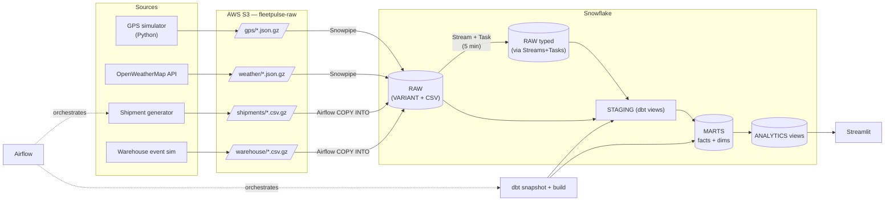

# Architecture

## Data flow



## Layers

1. **Ingestion**
   - `ingest.gps_simulator`: produces route-aware GPS pings, writes gzipped JSON
   - `ingest.weather_loader`: polls OpenWeatherMap at ≤1 QPS, writes gzipped JSON
   - `ingest.shipment_generator`: bulk CSV generator (~500K rows)
   - `ingest.warehouse_event_simulator`: CSV dock events
   - `LocalWriter` / `S3Writer` abstraction → switch via `FLEETPULSE_WRITER`

2. **Landing (Snowflake RAW)**
   - `GPS_EVENTS` (VARIANT) — Snowpipe auto-ingest
   - `WEATHER_OBSERVATIONS` (VARIANT) — Snowpipe
   - `SHIPMENTS`, `WAREHOUSE_EVENTS` — Airflow bulk COPY

3. **CDC (Streams + Tasks)**
   - `stream_gps_events_new` → `task_merge_gps_events` (every 5 min)
   - `stream_weather_new` → `task_merge_weather` (every 15 min)
   - Both merge VARIANT rows into typed tables downstream models consume.

4. **Transformation (dbt)**
   - **Staging** — typed views with dedupe (`QUALIFY`), coordinate bounds
   - **Intermediate** (ephemeral) — `int_gps_enriched` (lag-based speed deltas), `int_shipment_weather` (join to nearest observation), `int_route_performance`, `int_warehouse_dwell`
   - **Marts** — star schema: `fact_shipments`, `fact_gps_pings`, `fact_warehouse_events` (incremental, clustered) + SCD2 dims
   - **Snapshots** — `vehicles`, `warehouses`, `drivers` (check strategy)
   - **Analytics** — dashboard-facing views

5. **Orchestration (Airflow)**
   - `gps_stream_producer` — every 15 min
   - `weather_poller` — hourly
   - `fleetpulse_daily` — 02:00 UTC; generates shipments + runs `dbt snapshot`, `dbt build`, `dbt source freshness`

6. **Serving (Streamlit)**
   - Multi-page app: Fleet KPIs, Route Performance, Warehouse Utilization, Fleet Map, Anomaly Alerts
   - Demo-mode fallback when no Snowflake credentials are present

## Star schema

```mermaid
erDiagram
    FACT_SHIPMENTS }o--|| DIM_VEHICLE   : vehicle_sk
    FACT_SHIPMENTS }o--|| DIM_DRIVER    : driver_sk
    FACT_SHIPMENTS }o--|| DIM_ROUTE     : route_sk
    FACT_SHIPMENTS }o--|| DIM_WAREHOUSE : origin_warehouse_sk
    FACT_SHIPMENTS }o--|| DIM_WAREHOUSE : dest_warehouse_sk
    FACT_SHIPMENTS }o--|| DIM_DATE      : pickup_date
    FACT_GPS_PINGS }o--|| DIM_VEHICLE   : vehicle_id (current)
    FACT_WAREHOUSE_EVENTS }o--|| DIM_WAREHOUSE : warehouse_id (current)
```

## Warehouses

| Warehouse     | Size    | Auto-suspend | Use                        |
| ------------- | ------- | ------------ | -------------------------- |
| `INGEST_WH`   | X-Small | 60s          | Snowpipe + COPY INTO       |
| `TRANSFORM_WH`| Small   | 60s          | dbt builds                 |
| `ANALYTICS_WH`| Small   | 60s          | Streamlit + ad-hoc queries |

## Freshness targets

- GPS pings: **5 min** (Stream + Task)
- Weather: **15 min** (Stream + Task)
- Shipments / Warehouse events: **1 hour** (daily DAG; hourly upgrade possible)

## Materialization strategy

| Layer | Materialization | Why |
|---|---|---|
| `staging` | view | Always-current projection; cheap |
| `intermediate` | ephemeral | Pure CTE inlining; avoid extra objects |
| `marts` (facts) | incremental + merge + clustered | Large, append-mostly; merge on PK; clustering aligns with dashboard filters |
| `marts` (dims) | table (from snapshots) | SCD2 rebuilt from check-strategy snapshot |
| `analytics` | view | Dashboard-facing; one hop from facts |
